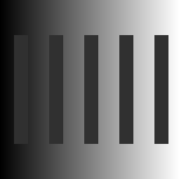
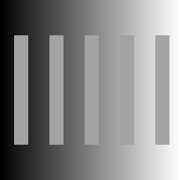

## Grayscale (Simultaneous Brightness Contrast Illusions)

This aims to illustrate the Simultaneous Brightness Contrast Illusions on a grayscale background. One takeaway from this is: Avoid using grayscale unless using only two to four levels of gray. (pps5a - Approach 5a-2)

### Results:

- Grayscale Background + Dimgray Rectangles:
  

- Grayscale Background + Lightgray Rectangles:
  

### References:

- [Image Processing in p5.js - Basic Setup](https://idmnyu.github.io/p5.js-image/index.html)
- [How to put p5.js canvas in a html div](https://stackoverflow.com/a/36540479)
- [p5.Js - Download](https://p5js.org/download/)
  - This is the link for downloading the p5.Js library.
